# DICOM Multi-Modal Mapping Guide

This document describes how to map and align different MRI sequences (T2, ADC, Calc) with segmentation masks for deep learning training.

## Visual Overview

### High-Level Pipeline Flow


### Spatial Coordinate System

```mermaid
flowchart LR
    subgraph DICOM["DICOM Header"]
        IOP["ImageOrientationPatient<br/>[Xx,Xy,Xz, Yx,Yy,Yz]"]
        IPP["ImagePositionPatient<br/>[Sx, Sy, Sz]"]
        PS["PixelSpacing<br/>[Δrow, Δcol]"]
        ST["SliceThickness<br/>Δslice"]
    end

    subgraph TRANSFORM["4×4 Transform Matrix"]
        M["| Xx·Δi  Yx·Δj  Zx·Δk  Sx |<br/>| Xy·Δi  Yy·Δj  Zy·Δk  Sy |<br/>| Xz·Δi  Yz·Δj  Zz·Δk  Sz |<br/>|   0      0      0     1  |"]
    end

    subgraph COORDS["Coordinates"]
        IJK["Voxel Index<br/>(i, j, k)"]
        LPS["World LPS<br/>(x, y, z) mm"]
    end

    IOP --> M
    IPP --> M
    PS --> M
    ST --> M
    
    IJK -->|"Matrix ×"| M
    M -->|"="| LPS

    style DICOM fill:#ffecb3
    style TRANSFORM fill:#b3e5fc
    style COORDS fill:#c8e6c9
```



### Resolution Comparison

```mermaid
flowchart TB
    subgraph T2["T2-Weighted (Reference)"]
        T2_SIZE["256 × 256 × 60 voxels"]
        T2_SPACE["0.664 × 0.664 × 1.5 mm"]
        T2_FOV["170 × 170 × 90 mm FOV"]
    end

    subgraph ADC["ADC / Calc (Moving)"]
        ADC_SIZE["132 × 160 × 20 voxels"]
        ADC_SPACE["1.625 × 1.625 × 3.6 mm"]
        ADC_FOV["214 × 260 × 72 mm FOV"]
    end

    subgraph RATIO["Resolution Ratio"]
        XY["In-plane: T2 is 2.4× higher res"]
        Z["Z-axis: T2 has 3× more slices"]
        FOV_DIFF["Different FOV & Origin!"]
    end

    T2 --> RATIO
    ADC --> RATIO

    style T2 fill:#c8e6c9
    style ADC fill:#ffcdd2
    style RATIO fill:#fff9c4
```



### Resampling Process Detail

```mermaid
sequenceDiagram
    participant ADC as ADC Volume<br/>(132×160×20)
    participant SITK as SimpleITK<br/>Resampler
    participant T2 as T2 Volume<br/>(256×256×60)
    participant OUT as Resampled ADC<br/>(256×256×60)

    Note over ADC,OUT: For each output voxel (i,j,k) in T2 grid:
    
    T2->>SITK: Get target voxel (i,j,k)
    SITK->>SITK: Convert to world coords<br/>(x,y,z) = T2_matrix × (i,j,k)
    SITK->>ADC: Find corresponding<br/>ADC voxel at (x,y,z)
    ADC->>SITK: (i',j',k') = ADC_matrix⁻¹ × (x,y,z)
    SITK->>SITK: Interpolate value<br/>(Linear or NearestNeighbor)
    SITK->>OUT: Store at (i,j,k)
    
    Note over ADC,OUT: Result: ADC data on T2 grid<br/>Same dimensions, spacing, origin
```



### highdicom SCImage Output


### Mask Padding Process

```mermaid
flowchart TB
    subgraph INPUT_MASK["Input: Sparse Mask"]
        SPARSE["processed_seg/.../prostate/<br/>├── 0021.png<br/>├── 0022.png<br/>├── ...<br/>└── 0049.png<br/><br/>Only 29 slices (21-49)"]
    end

    subgraph T2_REF["T2 Reference"]
        T2_SLICES["60 slices total<br/>(0000-0059)"]
    end

    subgraph PROCESS["Padding Process"]
        INIT["1. Create zeros array<br/>shape: (60, 256, 256)"]
        PARSE["2. Parse filename<br/>'0021.png' → idx=21"]
        FILL["3. Fill at index<br/>full_mask[21] = mask_data"]
    end

    subgraph OUTPUT_MASK["Output: Full Mask"]
        FULL["mask_prostate/<br/>├── 0000.png (zeros)<br/>├── ...<br/>├── 0020.png (zeros)<br/>├── 0021.png (data)<br/>├── ...<br/>├── 0049.png (data)<br/>├── 0050.png (zeros)<br/>├── ...<br/>└── 0059.png (zeros)"]
    end

    INPUT_MASK --> PROCESS
    T2_REF -->|"Dimensions"| PROCESS
    PROCESS --> OUTPUT_MASK

    style INPUT_MASK fill:#fff3e0
    style T2_REF fill:#e1f5fe
    style PROCESS fill:#f3e5f5
    style OUTPUT_MASK fill:#c8e6c9
```



### Visualization Pipeline


### Complete Data Flow Architecture

```mermaid
flowchart TB
    subgraph SOURCES["🏥 Original Data Sources"]
        TCIA["TCIA NBIA<br/>Raw DICOMs"]
        SLICER["3D Slicer<br/>Overlay Annotations"]
    end

    subgraph PREPROCESS["🔧 Preprocessing (Legacy)"]
        DICOM2PNG["dicom_to_png<br/>Extract pixel data"]
        OVERLAY2MASK["overlay_to_mask<br/>STL → PNG masks"]
    end

    subgraph PROCESSED["📂 Processed Data"]
        direction TB
        P_T2["processed/<br/>T2 PNGs"]
        P_ADC["processed_ep2d_adc/<br/>ADC PNGs"]
        P_CALC["processed_ep2d_calc/<br/>Calc PNGs"]
        P_SEG["processed_seg/<br/>Mask PNGs"]
        
        N_T2["nbia/<br/>T2 DICOMs"]
        N_ADC["nbia_ep2d_adc/<br/>ADC DICOMs"]
        N_CALC["nbia_ep2d_calc/<br/>Calc DICOMs"]
    end

    subgraph MAPPER["🗺️ DICOM Mapper Pipeline"]
        LOAD["load_modality_volume()<br/>PNG + DICOM metadata<br/>→ SimpleITK Image"]
        RESAMPLE["resample_to_reference()<br/>ADC/Calc → T2 grid"]
        CREATE_SC["create_sc_image()<br/>→ List[SCImage]"]
        EXPORT["Export PNGs + DICOMs"]
        MASK_PAD["Pad masks to T2 size"]
    end

    subgraph ALIGNED["📤 Aligned Output"]
        A_DCM["*_aligned/<br/>Per-slice DICOMs"]
        A_PNG["t2/, adc/, calc/<br/>Aligned PNGs"]
        A_MASK["mask_*/<br/>Padded mask PNGs"]
    end

    subgraph VIZ["📊 Visualization"]
        VIZ_OUT["visualizations_v2/<br/>Overlay images"]
    end

    TCIA --> PREPROCESS
    SLICER --> PREPROCESS
    PREPROCESS --> PROCESSED
    
    PROCESSED --> MAPPER
    
    LOAD --> RESAMPLE
    RESAMPLE --> CREATE_SC
    CREATE_SC --> EXPORT
    MASK_PAD --> EXPORT
    
    MAPPER --> ALIGNED
    ALIGNED --> VIZ

    style SOURCES fill:#ffecb3
    style PREPROCESS fill:#e0e0e0
    style PROCESSED fill:#e1f5fe
    style MAPPER fill:#f3e5f5
    style ALIGNED fill:#c8e6c9
    style VIZ fill:#fff9c4
```



---

## Data Structure Overview

### Processed Directories

| Directory | Content | Description |
|-----------|---------|-------------|
| `data/processed/` | T2-weighted images | High-resolution anatomical reference |
| `data/processed_ep2d_adc/` | ADC maps | Apparent Diffusion Coefficient from DWI |
| `data/processed_ep2d_calc/` | Calculated DWI | Derived diffusion images |
| `data/processed_seg/` | Segmentation masks | Prostate & target ROI masks |

### Directory Structure

```
data/processed/class{N}/case_{XXXX}/{SeriesInstanceUID}/
├── images/
│   ├── 0000.png
│   ├── 0001.png
│   └── ...
└── meta.json

data/processed_seg/class{N}/case_{XXXX}/{SeriesInstanceUID}/
├── prostate/
│   ├── 0010.png
│   └── ...
├── target1/
│   ├── 0014.png
│   └── ...
└── biopsies.json
```

## DICOM Spatial Properties

### T2-Weighted Series
- **Pixel Spacing**: 0.664mm × 0.664mm
- **Slice Thickness**: 1.5mm
- **Image Size**: 256 × 256
- **Typical Slice Count**: 50-60

### ADC / Calc Series
- **Pixel Spacing**: 1.625mm × 1.625mm
- **Slice Thickness**: 3.6mm
- **Image Size**: 132 × 160
- **Typical Slice Count**: 20

### Key Observations
1. **Resolution Ratio**: T2 is ~2.5× higher resolution than ADC/Calc
2. **Z-Spacing Ratio**: T2 has ~2.4× more slices (1.5mm vs 3.6mm spacing)
3. **Different FOV**: T2 and ADC/Calc may start at different z-positions

## Linking Keys

### StudyInstanceUID (Primary Link)
All sequences from the same imaging session share the same `StudyInstanceUID`:

```python
# Example for case_0001
T2:   StudyInstanceUID = "1.3.6.1.4.1.14519.5.2.1.85548304921965658367726869399297351743"
ADC:  StudyInstanceUID = "1.3.6.1.4.1.14519.5.2.1.85548304921965658367726869399297351743"  # Same!
Calc: StudyInstanceUID = "1.3.6.1.4.1.14519.5.2.1.85548304921965658367726869399297351743"  # Same!
```

### SeriesInstanceUID
Each sequence has a unique `SeriesInstanceUID`. Masks are aligned to T2 and share its SeriesInstanceUID.

### Spatial Coordinates
DICOM headers provide exact spatial positioning:
- `ImagePositionPatient`: (x, y, z) coordinates of first voxel in LPS
- `SliceLocation`: z-coordinate for each slice
- `ImageOrientationPatient`: Direction cosines for row/column (6 values)
- `PixelSpacing`: In-plane resolution [row_spacing, col_spacing]

### Coordinate System (LPS)
DICOM uses the **LPS** (Left-Posterior-Superior) coordinate system:
- **L**: Patient's left (positive X direction)
- **P**: Patient's posterior (positive Y direction)  
- **S**: Patient's superior/head (positive Z direction)

This is the same convention used by ITK/SimpleITK. 3D Slicer uses RAS internally but converts when reading/writing DICOM.

### IJK to World Transformation
The transformation from image indices (i, j, k) to world coordinates (x, y, z) is:

```
[x]   [Xx*Δi  Yx*Δj  Zx*Δk  Sx]   [i]
[y] = [Xy*Δi  Yy*Δj  Zy*Δk  Sy] × [j]
[z]   [Xz*Δi  Yz*Δj  Zz*Δk  Sz]   [k]
[1]   [0      0      0      1 ]   [1]
```

Where:
- `(Xx, Xy, Xz)` = row direction cosines (first 3 values of ImageOrientationPatient)
- `(Yx, Yy, Yz)` = column direction cosines (last 3 values of ImageOrientationPatient)
- `(Zx, Zy, Zz)` = slice direction (cross product of row × column)
- `(Δi, Δj, Δk)` = spacing (PixelSpacing[1], PixelSpacing[0], SliceThickness)
- `(Sx, Sy, Sz)` = origin (ImagePositionPatient)

## Slice Mapping Strategy

### Step 1: Extract Spatial Metadata
During DICOM conversion, extract per-slice z-positions:

```python
# From DICOM header
ds = pydicom.dcmread(dcm_file)
z_position = float(ds.ImagePositionPatient[2])  # or ds.SliceLocation
```

### Step 2: Build Z-Position Index
Create a lookup table for each series:

```python
t2_z_positions = [-74.88, -73.38, -71.88, ...]  # 60 values
adc_z_positions = [-64.83, -61.23, -57.63, ...]  # 20 values
```

### Step 3: Find Corresponding Slices
For each ADC/Calc slice, find the nearest T2 slice(s):

```python
def find_nearest_slice(target_z, reference_z_positions):
    """Find index of nearest slice by z-position."""
    distances = [abs(z - target_z) for z in reference_z_positions]
    return np.argmin(distances)

# Example: ADC slice at z=-61.23mm → T2 slice at z=-61.38mm (slice 9)
```

### Step 4: Resample to Common Grid
Use SimpleITK to resample ADC/Calc to T2 spatial grid. The key insight from 3D Slicer is that **proper resampling requires the full spatial metadata** (origin, spacing, AND direction):

```python
import SimpleITK as sitk
import numpy as np

def build_direction_matrix(orientation):
    """Build 3x3 direction matrix from ImageOrientationPatient (6 values)."""
    row_dir = np.array(orientation[0:3])  # Direction along columns (I axis)
    col_dir = np.array(orientation[3:6])  # Direction along rows (J axis)
    slice_dir = np.cross(row_dir, col_dir)  # K axis (normal to image plane)
    slice_dir = slice_dir / np.linalg.norm(slice_dir)
    
    # Return as flat 9-element array (row-major)
    return [
        row_dir[0], col_dir[0], slice_dir[0],
        row_dir[1], col_dir[1], slice_dir[1],
        row_dir[2], col_dir[2], slice_dir[2],
    ]

def resample_to_reference(moving_img, reference_img, interpolator=sitk.sitkLinear):
    """Resample moving image to reference geometry.
    
    Both images must have proper spatial metadata set:
    - Origin (from ImagePositionPatient)
    - Spacing (from PixelSpacing + SliceThickness)
    - Direction (from ImageOrientationPatient)
    """
    resampler = sitk.ResampleImageFilter()
    resampler.SetReferenceImage(reference_img)
    resampler.SetInterpolator(interpolator)
    resampler.SetDefaultPixelValue(0)
    resampler.SetTransform(sitk.Transform())  # Identity - spatial metadata handles mapping
    return resampler.Execute(moving_img)
```

**Critical**: For mask resampling, use `sitk.sitkNearestNeighbor` to preserve binary values.

## Multi-Channel Training Setup

### Target Output Structure (aligned_v2)
After processing with `dicom_mapper`:

```
data/aligned_v2/class{N}/case_{XXXX}/
├── t2_aligned/           (Directory of per-slice DICOMs)
│   ├── 0000.dcm ... 0059.dcm  (highdicom SCImage per slice)
├── adc_aligned/
│   ├── 0000.dcm ... 0059.dcm  (resampled to T2 grid)
├── calc_aligned/
│   ├── 0000.dcm ... 0059.dcm  (resampled to T2 grid)
├── t2/
│   ├── 0000.png ... 0059.png  (PNG exports)
├── adc/
│   ├── 0000.png ... 0059.png
├── calc/
│   ├── 0000.png ... 0059.png
├── mask_prostate/
│   ├── 0000.png ... 0059.png  (padded to match T2 slices)
├── mask_target1/
│   ├── 0000.png ... 0059.png
```

### DICOM Output Format (highdicom SCImage)
Due to highdicom's `SCImage` limitation (only supports 2D grayscale arrays), 
each slice is saved as a separate DICOM file within a shared series:

```python
# All slices share the same SeriesInstanceUID
series_uid = hd.UID()
for idx, frame in enumerate(frames):
    sc_image = SCImage(
        pixel_array=frame,  # 2D array per slice
        series_instance_uid=series_uid,
        instance_number=idx + 1,
        photometric_interpretation="MONOCHROME2",
        ...
    )
```

## Pipeline Commands

### Standardized Workflow (using highdicom)

```bash
# Full Processing (Align -> DICOM -> PNG)
uv run dicom-mapper process --input-dir data --output-dir data/aligned_v2

# Process specific class/case
uv run dicom-mapper process --input-dir data --output-dir data/aligned_v2 --class-num 3 --case-id 0290

# Visualize Alignment (overlay masks on T2/ADC/Calc)
uv run dicom-mapper visualize --aligned-dir data/aligned_v2 --output-dir data/visualizations_v2
```

## Implementation Details (highdicom)

### Why Per-Slice DICOMs?
The `highdicom.sc.SCImage` class only supports **2D grayscale** arrays with `MONOCHROME2` 
photometric interpretation. When passed a 3D array, it interprets it as RGB color `(rows, cols, 3)`.

**Solution**: Split 3D volumes into individual 2D slices, create one `SCImage` per slice, 
all sharing the same `SeriesInstanceUID`.

### Mask Handling
Masks in `processed_seg/` only cover slices with actual segmentation (e.g., slices 21-49).
The pipeline pads these to full T2 dimensions:

```python
# Create full-volume mask (zeros where no mask data)
full_mask = np.zeros((t2_num_slices, height, width), dtype=np.uint8)

# Fill in mask values at correct slice indices from filenames
for mask_file in mask_files:
    slice_idx = int(mask_file.stem)  # "0021.png" -> 21
    full_mask[slice_idx] = load_mask(mask_file)
```

### Key Dependencies
- **highdicom**: Creates standard DICOM Secondary Capture images
- **SimpleITK**: Handles spatial resampling with full IJK-to-world transformation
- **pydicom**: Reads source DICOM metadata

### Component Architecture


### Processing Sequence


## Troubleshooting

### Common Issues

1. **Missing ADC/Calc for some cases**
   - Not all cases have diffusion sequences
   - Check `data/nbia_ep2d_adc/` exists for the case

2. **Slice count mismatch after resampling**
   - ADC/Calc may not cover entire T2 volume
   - Missing slices filled with zeros or interpolated

3. **Misaligned masks on ADC/Calc**
   - Masks are created from T2-referenced STL overlays
   - **Root cause**: Different FOV and origin between T2 and ADC/Calc
   - **Solution**: Use full spatial transformation (origin + spacing + direction)
   - Simple resize is NOT sufficient - must use coordinate-based resampling

4. **highdicom SCImage "unexpected photometric interpretation" error**
   - **Cause**: Passing 3D array to SCImage (interprets as RGB)
   - **Solution**: Split into 2D slices, one SCImage per slice

5. **highdicom Segmentation errors**
   - `SEMIAUTOMATIC` not `SEMI_AUTOMATIC` (no underscore)
   - `AlgorithmIdentificationSequence` requires `family` parameter
   - Mask values must be 0/1 (not 0/255)

6. **Masks not visible in visualization**
   - Check `mask_*` directories exist in aligned output
   - Masks must be padded to match T2 slice count
   - Verify mask filenames match T2 PNG filenames (e.g., `0029.png`)

### Validation Checklist
- [ ] StudyInstanceUID matches across all sequences
- [ ] Resampled ADC/Calc have same dimensions as T2
- [ ] Mask indices align with T2 slice indices (0-padded to 4 digits)
- [ ] No empty channels in multi-modal stack
- [ ] Masks visually align with anatomy (yellow=prostate, red=target)

## Lessons from 3D Slicer

The 3D Slicer approach to multi-modal alignment uses these key principles:

1. **Full IJK-to-World Matrix**: Every image has a complete 4×4 transformation matrix that maps voxel indices to physical (LPS) coordinates.

2. **Coordinate System Consistency**: All operations are performed in a common coordinate system (LPS for DICOM/ITK, RAS for Slicer internal).

3. **Reference-Based Resampling**: When overlaying or combining images, one image serves as the reference geometry, and others are resampled to match.

4. **Direction Cosines Matter**: The `ImageOrientationPatient` tag is essential for correct spatial alignment, especially when images have different orientations or oblique acquisitions.

5. **Nearest Neighbor for Masks**: Binary masks should always use nearest-neighbor interpolation during resampling to preserve discrete values.

See `Slicer/Libs/vtkSegmentationCore/vtkOrientedImageDataResample.cxx` and `Slicer/Base/Python/sitkUtils.py` for implementation details.

